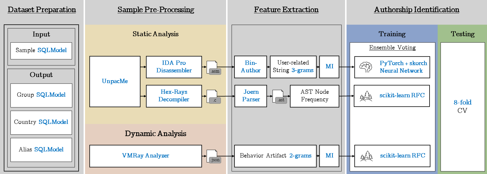
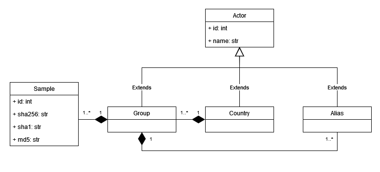

# Malware Authorship Attribution (MAA)

This repository contains *some* of the core Python scripts used in the master thesis:
> **Attribution of Malware Binaries to APT Actors using an Ensemble Classifier**

**Disclaimer:** _Due to the integration of third-party tools and confidential code, the entire MAA pipeline cannot be disclosed. Furthermore, please note that the APT samples and extracted features cannot be shared due to TLP. However, you may have a look at open-source malware repositories to collect the samples referenced in the datasets._

---

## Datasets

Two datasets were used to evaluate the proposed ensemble classifier: [APTClass](https://s3lab.isg.rhul.ac.uk/project/aptclass/) and [cyber-research](https://github.com/cyber-research/APTMalware).

### APTClass
APTClass is an annotated meta-dataset for MAA published by Gray et al.
The ground truth is based on threat intelligence reports published by government departments, anti-virus and security companies.

- Paper: [Identifying Authorship Style in Malicious Binaries: Techniques, Challenges & Datasets](https://s2lab.cs.ucl.ac.uk/downloads/aptclass.pdf)
- Dataset: [Bitbucket](https://bitbucket.org/jason_rhul/aptclass_dataset) (11,804 samples by 82 APT groups)

Some incorrect assignments were found in the dataset, which were forwarded to the authors and described in the thesis.
The applied corrections were comprehensibly committed to a dedicated Bitbucket repository and should soon be adopted by the authors.

### cyber-research
cyber-research is an annotated dataset including all referenced samples for MAA published by Coen Boot.
The ground truth is based on threat intelligence reports published by security vendors.


- Paper: [Applying Supervised Learning on Malware Authorship Attribution](https://www.ru.nl/publish/pages/769526/b_coen_boot.pdf)
- Dataset: [GitHub](https://github.com/cyber-research/APTMalware) (3,584 samples by 12 APT groups)

Similar to APTClass, a few mistakes were noticed, which are shown in the pull request in a comprehensible way:
[https://github.com/cyber-research/APTMalware/pull/2](https://github.com/cyber-research/APTMalware/pull/2)

---

## MAA Pipeline

The proposed malware authorship attribution pipeline is composed of four components, illustrated in the figure below.



### 1) Dataset Preparation

This component prepares the dataset by transforming the information about samples, APT groups, countries and aliases into a relational database using [SQLModel](https://sqlmodel.tiangolo.com/).
A parser for both datasets can be found in the `datasets` folder which filters out samples not complying with the MAA assumptions (e.g. file types or multiple actors) and splits the dataset into eight folds.
However, you must first request access to the APTClass CSV file `2021-jan-aptclass_dataset.csv` granted by Gray et al. before I am allowed to give you access to the corrected dataset `2022-aug-aptclass_dataset.csv`.
Furthermore, the cyber-research dataset by default does not include the file types in `overview.csv`, so keep a look at my forked repository [marius-benthin/cyber-research](https://github.com/marius-benthin/APTMalware).



It is assumed that the samples and extracted artifacts are stored in the following folder structure indexed by SHA-256.

```
/
├─ 00/
│  ├─ 00A1…F6BC/
│     ├─ 00A1…F6BC
│     ├─ 00A1…F6BC.c
│     ├─ 00A1…F6BC.ast
│     ├─ 00A1…F6BC.idb
│     ├─ 00A1…F6BC.i64
│     ├─ 00A1…F6BC_vmray.json
│
├─ 01/
├─ … /
├─ FF/
```

### 2) Sample Pre-Processing

The sample pre-processing component is divided into a static and dynamic stream.

#### Static Analysis

First, all samples in the datasets are unpacked with [UnpacMe](https://www.unpac.me/).
The service offers its own API, which can be used to automatically upload the samples and download the results.
A packed sample may contain one or multiple portable executables that have to be sorted into the folder structure as well.

Subsequently, the user-related strings were extracted using the disassembler [IDA Pro](https://hex-rays.com/ida-pro/) together with the IDAPython plugin [BinAuthor](https://github.com/g4hsean/BinAuthor).
Since IDA Pro 7.7 was used, the BinAuthor plugin had to be upgraded to Python 3 first (see [marius-benthin/BinAuthor](https://github.com/marius-benthin/BinAuthor)).
To automate the process, an [FastAPI](https://fastapi.tiangolo.com/) application was developed that accepts multiple samples in one IDA Pro session and disassembles them in parallel.
The source code and the Docker image can be found at `pre-processing/binauthor/`.

Simultaneously, all unpacked samples were converted to pseudo-like C code using the [Hex-Rays](https://hex-rays.com/decompiler/) decompiler. 
This was also done in parallel with one IDA session using a [FastAPI](https://fastapi.tiangolo.com/) application.
The source code and the Docker image can be found at `pre-processing/decompiler/`.
Afterwards, the decompiled code was transformed into an abstract syntax tree with the fuzzy parser [Joern](https://github.com/octopus-platform/joern) (Version 0.2.5) and [joern-tools](https://github.com/octopus-platform/joern-tools).
To do this, the code was first loaded into the Neo4j database deployed via the Docker image [neepl/joern](https://hub.docker.com/r/neepl/joern/) and afterwards exported using the joern-tools.

```sh
# index C file located in mounted folder code/ 
java -jar /joern/bin/joern.jar /code

# start Neo4j database
/var/lib/neo4j/bin/neo4j start

# generate abstract syntax tree
echo 'queryNodeIndex("type:Function").id' | joern-lookup -g | joern-plot-ast > /code/test.ast
```

Please note that the most recent [Joern](https://github.com/joernio/joern) version is recommended for new attribution pipelines because its faster and more stable.
However, due to reproducibility with Caliskan et al. approach this pipeline stick with the old version.


#### Dynamic Analysis

Since in dynamic analysis the samples unpack in memory anyway, the original possibly packed samples were used.
All portable executables are executed with VMRay Analyzer on a Windows 10 64-bit system for a maximum of three minutes without Internet connection.
Afterwards, the JSON report of the Analysis Results Reference v1 have been downloaded and stored next to the sample in the folder structure. 

### 3) Feature Extraction

The feature extraction component decomposes the user-related strings and behavior artifacts into 3-grams or 2-grams respectively and calculates the mutual information for the derived `numpy` feature vector.
Furthermore, the abstract syntax tree nodes are simply counted and also stored in a `numpy` feature vector.

Since the feature space for the n-grams gets very large, only the top 10% n-grams are selected using mutual information.
This feature selection has to be conducted eight times, because the 8-fold cross-validation splits the dataset into eight training sets with each seven folds.

### 4) Authorship Identification

The last component is the authorship identification, which first employs a feedforward neural network for the user-related string tri-grams and two random forests for the AST nodes and dynamic behavior bi-grams.
Subsequently, the predictions are passed to the ensemble classifier with soft voting to output the final attribution.